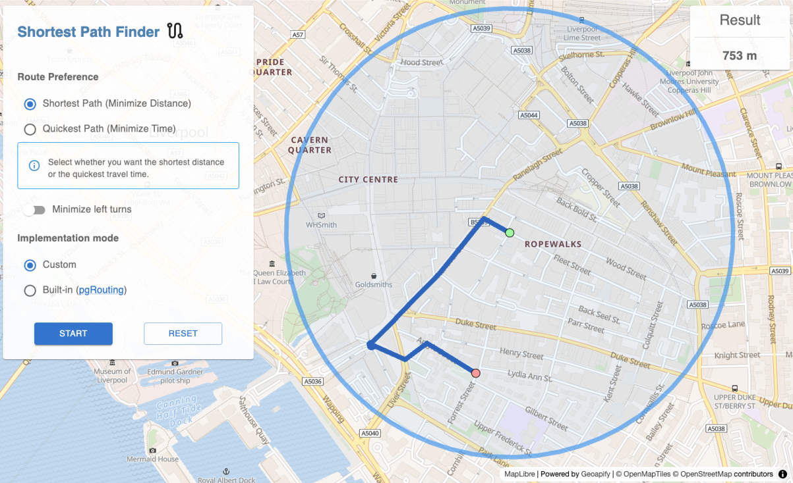
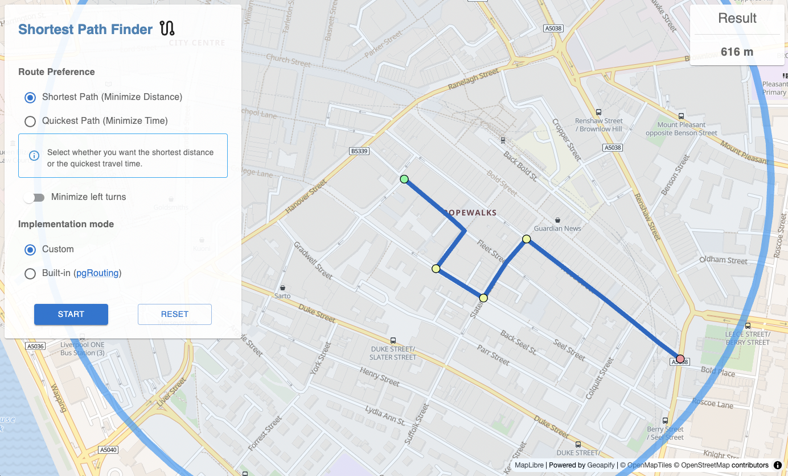

# Shortest Path Map Finder

## Overview

The **Shortest Path Map Finder** application is designed to calculate the optimal route between multiple points within a city based on selected parameters, such as **distance**, **time**, and **left-turn minimization**. The project leverages real-world spatial data to provide practical routing solutions. It combines a user-friendly interface, efficient backend processing, and basic algorithms to meet the requirements of modern spatial navigation systems.

## Features

- **Route Calculation**: Find the shortest or fastest route between multiple points.
- **Custom Algorithms**: Includes a custom implementation of Dijkistra algorithm for left-turn minimization.
- **Built-in Algorithms**: Utilizes pgRouting's built-in algorithms like Dijkstra.
- **Interactive Map**: Select points directly on a map using React and MapLibre GL.
- **REST API**: Backend services powered by Kotlin and Spring Boot.
- **Spatial Data Integration**: PostgreSQL with PostGIS for advanced spatial queries.

## Technologies Used

- **Frontend**: React (TypeScript), MapLibre GL, Deck.gl
- **Backend**: Spring Boot (Kotlin)
- **Database**: PostgreSQL with PostGIS and pgRouting
- **Spatial Data**: OpenStreetMap (OSM) data provided by Geofabrik
- **Containerization**: Docker for managing the database and import processes

## Screenshots




## Installation and Setup Guide

Follow these steps to set up the project on your local machine:

### Step 1: Clone the Repository

```text
git clone https://github.com/mikpaszkowski/shortest-path-map-finder.git
cd shortest-path-map-finder
```

### Step 2: Download Spatial Data

Edit the **OSM_URL** variable in download_osm.sh file to fetch your desired osm data or leave it to fetch Liverpool city data by default:

```bash
OSM_URL="https://download.geofabrik.de/europe/united-kingdom/england/merseyside-latest.osm.pbf"
```

Then run the following script to download and prepare OSM data:

```bash
chmod +x ./scripts/download_osm.sh
./scripts/download_osm.sh
```

### Step 3: Configure and Start the Environment

Use Docker Compose to set up the PostgreSQL database with PostGIS:

```bash
docker compose up --build
```

The OSM data will be importe automatically via import.sh executment as entrypoint of Dockerfile.

### Step 5: Configure pgrouting extension and the database

Before running the full app, you need to do couple of following steps:

- Run SQL queries in database/init.sql (these are for penalization of roads that are not desired for quickest route profile)
- We need to enable pgrouting in the postgis database. Since the postgis container provided in this config does not have pgrouting installed and enabled we need to do that manually (for now on).

First, run enter the shell sesion of the running postgis container:

```bash
docker exec -it <container_id> bin/sh
```

Then, run the script (copy-paste) that can be found in **/database/pgrouting_db_enable.sh**

After that, the pgrouting package can be found inside the container and then we can set it up:

- Please follow the steps inside this manual: https://docs.pgrouting.org/4.0/en/pgRouting-installation.html

## Running app locally

When the pgrouting and the database will be configured and ready to go we can run ui and backend.

- Before running the UI please provide API key for geopify API. Visit: https://www.geoapify.com/ and provide a key in /config.ts.

```bash
cd map-ui/src
touch .env
echo "VITE_API_KEY=<YOUR_API_KEY>" >> .env
```

```bash
# Run ui

cd map-ui
npm i
npm run dev

#  Run backend
cd path-api
mvn clean install
mvn spring-boot:run
```

## USage

- Open the frontend in your browser (default: http://localhost:3000).
- Select start, end, and intermediate points on the map.
- Configure route parameters (distance, time, custom options).
- Click "Start" to calculate and visualize the route.

## API endpoints

Find Nearest Node

```
GET /nearest-point?latitude={latitude}&longitude={longitude}
```

Calculate Shortest Path - built-in

```
GET /shortest-path?sourceId={sourceId}&targetId={targetId}?minimizeLeftTurns={boolean}
```

Calculate Shortest Path - custom

```
GET /shortest-path/custom?sourceId={sourceId}&targetId={targetId}?minimizeLeftTurns={boolean}
```

Calculate Path with Intermediate Points

```
GET /shortest-path/intermediate-points?sourceId={sourceId}&targetId={targetId}&routePreference={preference}&intermediatePoints={points}?minimizeLeftTurns={boolean}
```

Custom Path Calculation with Intermediate Points

```
GET /shortest-path/custom?sourceId={sourceId}&targetId={targetId}&routePreference={preference}&intermediatePoints={points}?minimizeLeftTurns={boolean}
```

## Contribution

Contributions are welcome! Please fork the repository and submit a pull request.

## License

This project is licensed under the MIT License.
